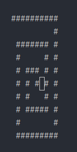
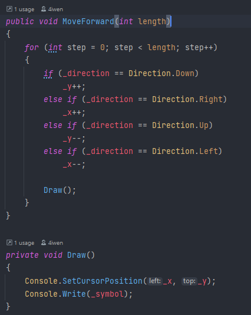
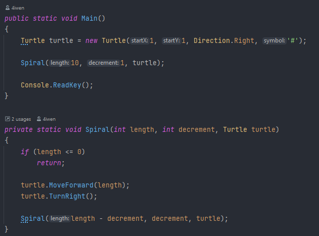

# Dokumentace kódu spirály

## Výsledek při vstupních parametrech 10, 1

## Popis řešení
Celý algoritmus jsem vyřešil uděláním své vlastní třídy *Turtle*, která si drží pozici kursoru v konzoli a implementuje 2 metody - *TurnRight* - která otočí směr kursoru vpravo o 90 stupňů a metodu *MoveForward* - která posune kursor o danou délku a vypíše za sebou určený znak.

Při startu programu se vytvoří instance třídy *Turtle* s veškerým nastavením, potom se zavolá rekursivní metoda *Spiral*, která volá metody třídy *Turtle* a sama sebe tak dlouho, dokud délka strany spirály není menši nebo rovno nule.
